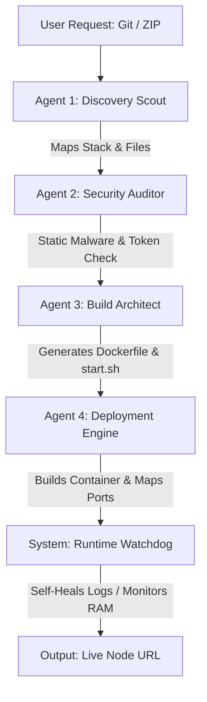

# ☁️ BrahMos Cloud — The AI-Native PaaS Built on a Mobile Phone

[](https://github.com/ankurmoran96-openai)
[](https://github.com/ankurmoran96-openai)
[](https://github.com/ankurmoran96-openai)

BrahMos Cloud is a high-performance, AI-native **Platform as a Service (PaaS)** that automates the deployment of Telegram bots, web APIs, and web applications. It uses advanced LLM orchestration to analyze repository files, generate configuration setups, compile custom container builds, and perform malware security checks dynamically before execution.

---

## 📱 The Phone-Built Legend (Ankur's Story)

This entire cloud platform—featuring multi-agent LLM pipelines, asynchronous Docker SDK operations, dynamic webhook triggers, and resource watchdog loops—was engineered entirely on a **15-year-old developer's Oppo A3 5G mobile phone** in Assam, India. 

Using **Termux** as a mobile Linux terminal, **vim** for code edits, and remote SSH loops, this project is proof of first-principles engineering and absolute grit. No fancy developer laptops, no high-end setups—just pure logical reasoning and high-frequency code execution on Android.

---

## 🏗️ Core Architecture & Agent Flow

When a developer submits a GitHub repository URL or uploads a project ZIP, BrahMos Cloud executes a multi-stage **agentic pipeline**:



### 1. Agent 1: Discovery Scout
- Recursively scans the codebase to identify the language, frameworks (Node.js, Python, Go, etc.), and main entry points.
- Compiles the project dependency tree and feeds the map to the next agent.

### 2. Agent 2: Security Auditor
- Audits the source code for hardcoded tokens, sensitive API keys, and potential malicious injections.
- Determines if the code contains backdoors before starting the container builder.

### 3. Agent 3: Build Architect
- Automatically writes a customized `Dockerfile`, configures startup files (`start.sh`, `.env`), and maps the internal project ports.
- Guarantees compatibility with target runners.

### 4. Agent 4: Deployment Engine
- Interface with the Docker SDK to pull base images, build custom container layers, isolate system networking, and map external ports to subdomain URLs (e.g. `http://<container_id>.<domain>.com`).

---

## ⚡ Technical Highlights

- **Fernet Symmetric Encryption at Rest**: All GitHub Personal Access Tokens (PATs) used to clone private user repositories are stored encrypted at rest using symmetric key rotation, preventing leaks in the case of host file access.
- **Asynchronous Concurrent Locks**: Built thread-safe locks using reentrant locking (`threading.RLock()`) on all critical databases (database JSON operations) to guarantee data integrity under concurrent user deployments.
- **Self-Healing Container Loop**: A monitoring module that reads raw container error logs, analyzes reasons for termination (e.g., missing dependencies, incorrect ports), and automatically re-architects configuration scripts to self-heal and restart the deployment.

---

## ⚠️ Potential Bugs & Caveats (Development Mode)

BrahMos Cloud is currently in active development. As a consequence of building on a single host node and running high-frequency deployments, developers should be aware of the following issues:

1. **Host Resource Spikes (Build Bottleneck)**:
   - *Issue*: Running multiple concurrent Docker image builds and LLM compilation calls on a single Host VPS causes CPU and RAM spikes.
   - *Mitigation*: Build queues are being implemented; currently, concurrent builds may temporarily slow down active servers.

2. **Docker Socket File Descriptor Exhaustion**:
   - *Issue*: High-frequency restarts, container deletion, and log fetching via the Docker SDK can occasionally leak file descriptors or lock the Docker daemon socket (`/var/run/docker.sock`).
   - *Mitigation*: We are implementing socket reuse and keep-alive connections.

3. **Webhook Payload Variations**:
   - *Issue*: GitHub webhook payloads for events other than direct pushes (such as tag creations or pull request merges) can occasionally drift in JSON structure, causing the webhook parser to crash on undefined author/commit variables.
   - *Mitigation*: The webhook listener now contains fallback parsers for message extraction.

4. **Database Lock Contention**:
   - *Issue*: Under heavy loads, concurrent file writes to the database file (`database.json`) can result in write-blockages despite thread locking.
   - *Mitigation*: Future plans involve migrating from local JSON files to PostgreSQL.

5. **Telegram API Rate Limits**:
   - *Issue*: Live build logs and status updates are sent directly via Telegram. Under massive build outputs, the bot can hit Telegram's 30 messages/second rate limit, causing temporary delivery delays.

---

## 🚀 Setting Up Locally

### Prerequisites
- Python 3.10+
- Docker Engine installed and running
- System daemon access (sudo)

### Installation
1. Clone the repository:
   ```bash
   git clone https://github.com/ankurmoran96-openai/brahmoscloud.git
   cd brahmoscloud
   ```
2. Install dependencies:
   ```bash
   pip3 install -r requirements.txt
   ```
3. Set up your environment variables:
   ```bash
   cp .env.example .env
   # Add your BOT_TOKEN, AI_API_KEY, and GITHUB_PAT
   ```
4. Run the core listener:
   ```bash
   python3 main.py
   ```

---

## 📜 License
MIT License. Built with vision and relentless first-principles coding by **Ankur Moran**.
[Telegram Developer Link](https://t.me/ankurslys) | [Official Channel](https://t.me/brahmosai)
